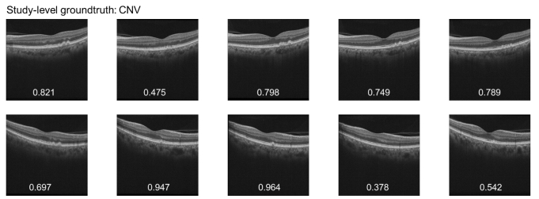
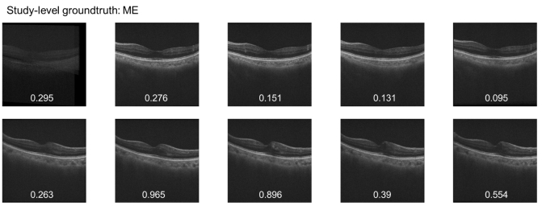

## Multi-label Classification

**MMID** stands for Multi-frame Medical Images Distillation

### MMID Stage1

- Train with `train_multi_avg_fusion.py` and `fusion_model.py`.
- Use the resulting checkpoint to predict the train studies with `batch_predict50_csv_buildmynewtrain.py` and `fusion_model_buildmynewtrain.py`.
- `fusion_model_buildmynewtrain.py` is a modified `fusionmodel` that returns the weights of each image contribution.

### MMID Stage2

- Train with `train_multi_org.py` using the distillation result training set.

MMID demonstrates a simple yet significantly performance-improving distillation strategy, used for medical imaging, especially OCT image classification, multi-label, or dataset organization.

These two examples shows the automatic weights calculation within a macular OCT study

## Medical Report Generation

- Train with `main_oct.py` and `r2genUPD_version2.py`, which is an improvement scheme for multi-frames medical image report generation.

** main improvements:**

#For OCT multi-frame images, use a 10-frame sampling.
#The improved multi-frame images employ a feature fusion strategy in the CNN encoder-decoder architecture.
#Through cross-task feature fusion, multi-label diagnostic signals are used as auxiliary information to enhance report generation performance.
This is the first time we have performed the task of report generation in OCT medical images, and the model improvements we have made demonstrate a more reliable performance.

## Environment
Anaconda3 (highly recommendation)

python3.6/3.7/3.8

vscode (IDE)

pytorch 1.10 (pip package)

torchvision 0.11.1 (pip package)

